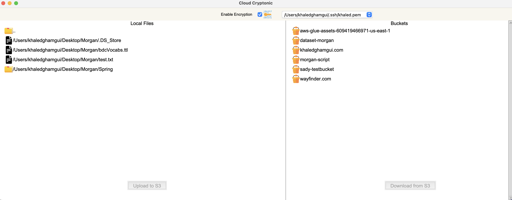

# Cloud Cryptonic

Cloud Cryptonic is a Python-based Graphical User Interface (GUI) application that enables secure file uploads and downloads to and from Amazon Web Services (AWS) S3. The application utilizes client-side encryption to ensure data privacy and offers seamless integration with AWS S3 for file storage and retrieval. The user-friendly GUI makes it easy for individuals and organizations to securely transfer files while maintaining control over their data.



## Features

- Secure Client-Side Encryption: Files are encrypted locally on the user's device before being uploaded to AWS S3, ensuring data confidentiality and privacy.
- AWS S3 Integration: Cloud Cryptonic seamlessly integrates with AWS S3, enabling users to store and retrieve files from their S3 buckets.
- Decryption of Downloaded Files: Downloaded files are decrypted locally on the user's device, ensuring secure access to the data.
- User-Friendly GUI: The intuitive GUI provides an easy-to-navigate interface for effortless file management and secure transfers.

## Installation

1. Install the required dependencies:
   ```shell
   pip install -r requirements.txt
2. Run the application:
   ```shell
   python main.py


## Prerequisites
To use Cloud-Cryptonic, you will need to set up a local AWS profile. Note that the app will use the default profile. 

## Usage

1. Launch the Cloud Cryptonic application.
2. Select the key used to encryption
3. Use the intuitive GUI to select and upload files securely to AWS S3.
4. Retrieve files by selecting them from the file list and clicking the download button. The file will be automatically decrypted.

You can also use Cloud Cryptonic to upload/download files from S3 in plain.

## Contributions

Contributions to Cloud Cryptonic are welcome! If you encounter any issues or have suggestions for improvements, please feel free to submit a pull request or open an issue on the GitHub repository.

## License

Cloud Cryptonic is licensed under the [MIT License](LICENSE). Feel free to use, modify, and distribute the code as per the terms of the license.

## Acknowledgements

- Cloud Cryptonic utilizes the [Boto3](https://boto3.amazonaws.com/v1/documentation/api/latest/index.html) library for AWS S3 integration.
- The GUI is built using the [Tkinter](https://docs.python.org/3/library/tkinter.html) library.

## Contact

If you have any questions or inquiries, please contact [gham.khaled@gmail.com](mailto:gham.khaled@gmail.com).
